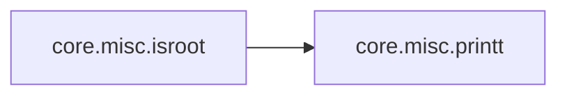

# Core Misc

[_Documentation generated by Documatic_](https://www.documatic.com)

<!---Documatic-section-Codebase Structure-start--->
## Codebase Structure

<!---Documatic-block-system_architecture-start--->
```mermaid
None
```
<!---Documatic-block-system_architecture-end--->

# #
<!---Documatic-section-Codebase Structure-end--->

<!---Documatic-section-core.misc.printt-start--->
## [core.misc.printt](4-core_misc.md#core.misc.printt)

<!---Documatic-section-printt-start--->
<!---Documatic-block-core.misc.printt-start--->
<details>
	<summary><code>core.misc.printt</code> code snippet</summary>

```python
def printt(s, msg):
    if s == 1:
        print('\x1b[01;31m[%s] Error: %s\x1b[00m' % (time.strftime('%H:%M:%S'), msg))
        sys.exit(1)
    elif s == 2:
        print('\x1b[01;32m[%s] %s\x1b[00m' % (time.strftime('%H:%M:%S'), msg))
    elif s == 3:
        print('\x1b[01;01m[%s] %s\x1b[00m' % (time.strftime('%H:%M:%S'), msg))
    else:
        print('\x1b[01;01m[%s] %s\x1b[00m' % (time.strftime('%H:%M:%S'), msg))
```
</details>
<!---Documatic-block-core.misc.printt-end--->
<!---Documatic-section-printt-end--->

# #
<!---Documatic-section-core.misc.printt-end--->

<!---Documatic-section-core.misc.print_help-start--->
## [core.misc.print_help](4-core_misc.md#core.misc.print_help)

<!---Documatic-section-print_help-start--->
<!---Documatic-block-core.misc.print_help-start--->
<details>
	<summary><code>core.misc.print_help</code> code snippet</summary>

```python
def print_help():
    print('\t\x1b[01;32mshow   : show default settings.')
    print('\tset    : set settings (set port 80).')
    print('\trun    : start the server.')
    print('\tclear  : clear screen.')
    print('\thelp   : show help.')
    print('\tquit   : bye bye.\x1b[00m')
```
</details>
<!---Documatic-block-core.misc.print_help-end--->
<!---Documatic-section-print_help-end--->

# #
<!---Documatic-section-core.misc.print_help-end--->

<!---Documatic-section-core.misc.isroot-start--->
## [core.misc.isroot](4-core_misc.md#core.misc.isroot)

<!---Documatic-section-isroot-start--->


### Object Calls

* [core.misc.printt](4-core_misc.md#core.misc.printt)

<!---Documatic-block-core.misc.isroot-start--->
<details>
	<summary><code>core.misc.isroot</code> code snippet</summary>

```python
def isroot():
    if os.getuid() != 0:
        printt(1, 'Please run weeman as root.')
```
</details>
<!---Documatic-block-core.misc.isroot-end--->
<!---Documatic-section-isroot-end--->

# #
<!---Documatic-section-core.misc.isroot-end--->

[_Documentation generated by Documatic_](https://www.documatic.com)