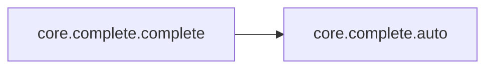

# Core Complete

[_Documentation generated by Documatic_](https://www.documatic.com)

<!---Documatic-section-Codebase Structure-start--->
## Codebase Structure

<!---Documatic-block-system_architecture-start--->
```mermaid
None
```
<!---Documatic-block-system_architecture-end--->

# #
<!---Documatic-section-Codebase Structure-end--->

<!---Documatic-section-core.complete.complete-start--->
## [core.complete.complete](5-core_complete.md#core.complete.complete)

<!---Documatic-section-complete-start--->


### Object Calls

* core.complete.auto

<!---Documatic-block-core.complete.complete-start--->
<details>
	<summary><code>core.complete.complete</code> code snippet</summary>

```python
def complete(array):
    completer = auto(array)
    readline.set_completer(completer.complete)
    readline.parse_and_bind('tab:complete')
```
</details>
<!---Documatic-block-core.complete.complete-end--->
<!---Documatic-section-complete-end--->

# #
<!---Documatic-section-core.complete.complete-end--->

[_Documentation generated by Documatic_](https://www.documatic.com)