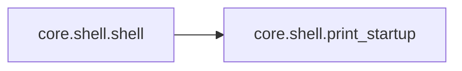

# Core Shell

[_Documentation generated by Documatic_](https://www.documatic.com)

<!---Documatic-section-Codebase Structure-start--->
## Codebase Structure

<!---Documatic-block-system_architecture-start--->
```mermaid
None
```
<!---Documatic-block-system_architecture-end--->

# #
<!---Documatic-section-Codebase Structure-end--->

<!---Documatic-section-core.shell.print_startup-start--->
## [core.shell.print_startup](7-core_shell.md#core.shell.print_startup)

<!---Documatic-section-print_startup-start--->
<!---Documatic-block-core.shell.print_startup-start--->
<details>
	<summary><code>core.shell.print_startup</code> code snippet</summary>

```python
def print_startup():
    print('\x1b[01;31m')
    print(open('core/logo.txt', 'r').read())
    print('\x1b[00m')
    print('\x1b[01;33m\t    ..:: Weeman %s (%s) ::..\x1b[00m' % (__version__, __codename__))
    print('\x1b[01;34m\t-------------------------------------\x1b[00m')
    print("\t'There are plenty of fish in the sea'")
    print('\x1b[01;34m\t-------------------------------------\n\x1b[00m')
```
</details>
<!---Documatic-block-core.shell.print_startup-end--->
<!---Documatic-section-print_startup-end--->

# #
<!---Documatic-section-core.shell.print_startup-end--->

<!---Documatic-section-core.shell.shell-start--->
## [core.shell.shell](7-core_shell.md#core.shell.shell)

<!---Documatic-section-shell-start--->


### Object Calls

* [core.shell.print_startup](7-core_shell.md#core.shell.print_startup)

<!---Documatic-block-core.shell.shell-start--->
<details>
	<summary><code>core.shell.shell</code> code snippet</summary>

```python
def shell():
    global url
    global port
    global action_url
    global user_agent
    print_startup()
    complete(array)
    if os.path.exists('history.log'):
        if os.stat('history.log').st_size == 0:
            history = open('history.log', 'w')
        else:
            history = open('history.log', 'a')
    else:
        history = open('history.log', 'w')
    while True:
        try:
            an = raw_input(' (weeman ) : ')
            prompt = an.split()
            if not prompt:
                print('Error: What? try help.')
            elif prompt[0] == ';' or prompt[0] == 'clear':
                print('\x1b[H\x1b[J')
            elif prompt[0] == 'q' or prompt[0] == 'quit':
                printt(2, 'bye bye!')
                break
            elif prompt[0] == 'help' or prompt[0] == '?':
                print_help()
            elif prompt[0] == 'show':
                l = 11 + len(url)
                sys.stdout.write('\x1b[01;32m\t')
                print('-' * l)
                print('\turl        : %s ' % url)
                print('\tport       : %d ' % port)
                print('\taction_url : %s ' % action_url)
                print('\tuser_agent : %s ' % user_agent)
                sys.stdout.write('\t\x1b[00m')
                print('-' * l)
            elif prompt[0] == 'set':
                if prompt[1] == 'port':
                    port = int(prompt[2])
                    history.write('port = %s\n' % port)
                if prompt[1] == 'url':
                    url = str(prompt[2])
                    history.write('url = %s\n' % url)
                if prompt[1] == 'action_url':
                    action_url = str(prompt[2])
                    history.write('action_url = %s\n' % action_url)
                if prompt[1] == 'user_agent':
                    prompt.pop(0)
                    u = str()
                    for x in prompt:
                        u += ' ' + x
                    user_agent = str(u.replace('user_agent', ''))
                    history.write('user_agent = %s\n' % user_agent)
            elif prompt[0] == 'run' or prompt[0] == 'r':
                s = weeman(url, port)
                s.clone()
                s.serve()
            elif prompt[0] == 'banner' or prompt[0] == 'b':
                print_startup()
            else:
                print("Error: '%s' What? try help." % prompt[0])
        except KeyboardInterrupt:
            s = weeman(url, port)
            s.cleanup()
            print('\nInterrupt ...')
        except Exception as e:
            printt(3, 'Error: Weeman recived error! (%s)' % str(e))
```
</details>
<!---Documatic-block-core.shell.shell-end--->
<!---Documatic-section-shell-end--->

# #
<!---Documatic-section-core.shell.shell-end--->

[_Documentation generated by Documatic_](https://www.documatic.com)